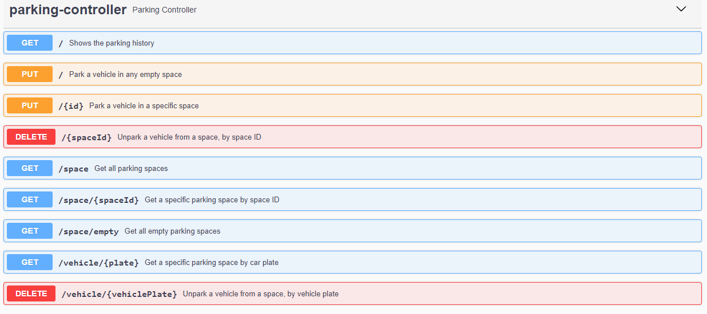

# Parking API

## A set of APIs developed with Spring Boot, for controlling a vehicle parking lot
---

### Requirements

A parking lot should have a limited number of parking spaces. Vehicles can be parked on these spaces by its Id or in any empty one.

Vehicles can be taken out by its plate or by the space id.

Upon being taken out, a hourly bill should be calculated and the vehicle saved on a history.

The APIs should be secured with Spring Security and documented with Swagger.

We should strive to the maximum (reasonably) test coverage possible.


## Tech Stack
| | |
|-|-|
|Java 19||
|Maven||
|Spring Boot||
|Spring Web||
|Spring security||
|Spring AOP|For aspect oriented logging|
|Mysql||
|JPA||
|Lombok||
|Junit||
|Rest Assured|API Testing|
|Docker||
|Test Containers|In order to quickly set up clean, reusable databases for testing|
|Swagger|For documenting APIs|


Test coverage is hanging around 86%, I find any more tests would be too redundant.

There are JavaDocs comments where is need to explain design choices, but otherwise, the code is self-documented.

All the exception handling is centralized in a Spring's Controller Advice and should present exception information to the frontend via a Json response.

```
# default Spring Security user
    admin

# default Spring Security password
    admin
```

Quick look at the endpoints:
